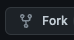

# Learn_you_a_git

## Repository to teach people how to use Git

This repository has several directories, files and uses .gitignore and will be useful in demonstrating how to use a git
repository in everyday work (and home life if you want.) 

## How to start.

### Install Git
#### Mac OS:

The recommended method for this is to use Homebrew. 
HomeBrew `brew install git` 

(If you don't have HomeBrew, I recommend it, instructions [here](https://brew.sh/).) 

Windows:
Download the latest installer from [here](https://git-scm.com/download/win)

Linux: 
Unlikely that many are using this, but: 
Debian based distros: 
`sudo apt update && sudo apt install git -y`
Redhat based distros:
`sudo yum install git -y`
If you use a non-debian or redhat derived distro, I trust that you already know how to install git using your package 
manager. 

### Clone this repository
A repository is a (mostly) self-contained source code directory which has a `.git`  directory in it. Most of the time
at work, you'll be either making a repository on github/gitlab/bitbucket/git host of choice using a web interface, or 
cloning an existing one. We won't be making local only repositories. You _can_ use git entirely locally, but it's not
common in commercial software development. Should you ever want to make a local git repository, you can simply create
a directory, navigate there on your command line (bash, CMD, PowerShell, doesn't matter), and use the command
`git init`.

You will need a Github account for this course, they're free and easy to create, so I hope you will make one if you
don't already have one. Once you've created a github account, you'll need to add an ssh key, follow 
[these instructions](https://docs.github.com/en/authentication/connecting-to-github-with-ssh).

To start with you'll want to clone this repository, make a new directory on your machine (either using your file manager
or on the command line with `mkdir <my awesome directory>`). This directory will hold your repository.

Then you will need to navigate to that directory `cd <path to my awesome directory>` in the command line and there we 
will clone this repository with `git clone git@github.com:Dominic-Kua/Learn_you_a_git.git`

### What do I have now?

Now you have this repository on your local machine! You can do whatever you like to this repository on your machine and 
it won't affect the copy on Github. In fact you won't be able to change any of the code on the github repository from 
this clone, because you're not a member of the repository, 

### How can I make changes then?

There's two ways, you can be a member of the repository which would give you a certain access level, perhaps commit 
access to certain branches (more on branching later), merge access (ditto), or other rights. But the way we're going to 
do it today is by _forking_ the repository. This means you'll be making your own copy of the repository in your 
account on Github. 

Go to the repository page again and hit  and you will be presented with 

You can then delete the old repository and clone your new copy of the repository in the same place. Unless you've made 
changes to the existing code already, this should look basically identical in your IDE/text editor. 

### Now for a brief aside on the Git model
